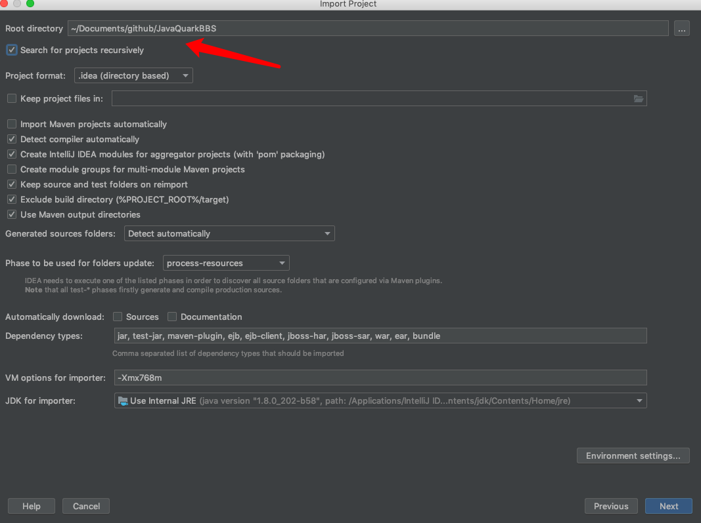

<details>
<summary><b>1.安装环境</b></summary>
<br/>
<b>1.2 JDK8</b>
<p>Ubuntu:</p>

```bash
sudo apt update
sudo apt install openjdk-8
```
如果机器上之前已经安装了JDK其他版本推荐使用
http://www.jenv.be 来管理多个JDK


<b>1.3 MySQL</b>
安装教程自行百度，如果遇到安装的时候没有提示mysql密码参考：
- Ubuntu: https://blog.csdn.net/sinat_21302587/article/details/76870457
- Mac : https://www.jianshu.com/p/07a9826898c0

<b>1.4 Maven</b>
安装教程自行百度

<b>1.5 Lombok</b>
IDEA插件库里去安装
</details>

<details>
<summary><b>2. 开发环境</b></summary>
1.clone项目到本地

```bash
git clone git@github.com:sunnyblog/geekbb.git
```

推荐使用ssh方式克隆，不要使用Https，这样每次提交都会让你输入账号和密码。百度搜索ssh-key生成

2.导入项目进入IDEA,把整个文件夹都导入进去如下图



3.idea会自动安装项目依赖

4.下载redis。如果安装自行百度

5.创建数据库quarkCommunity，导入resource文件下的sql文件

5.idea启动项目，XXXApplication
推荐启动顺序如下
- quark-rest (API服务)
- quark-chat (聊天服务)
- quark-protal(前端服务)
- quark-admin （后台服务）
</details>


